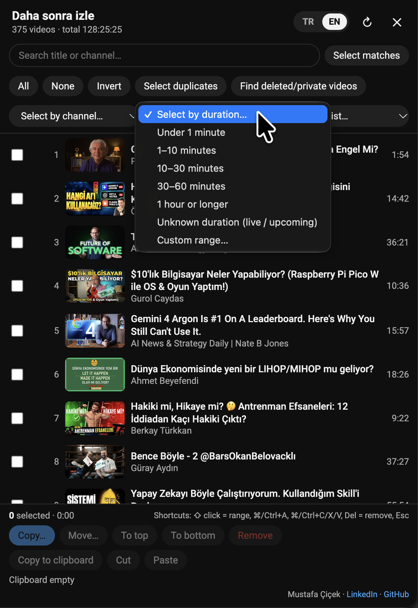
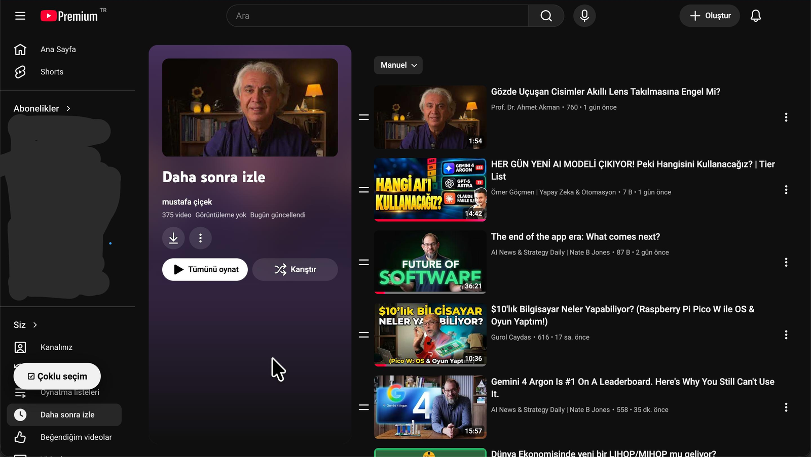
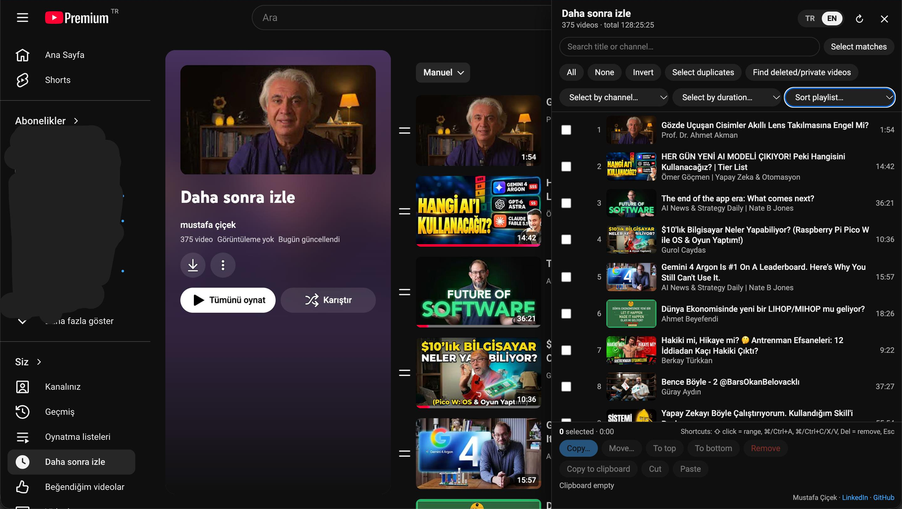
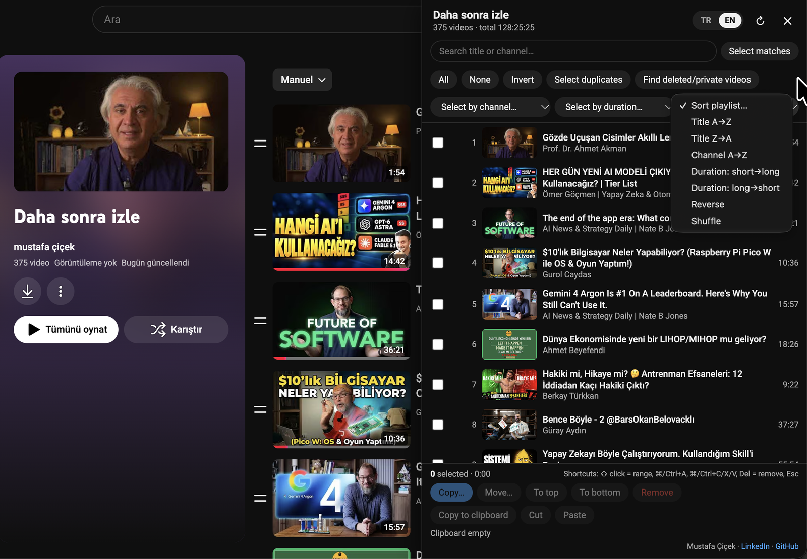
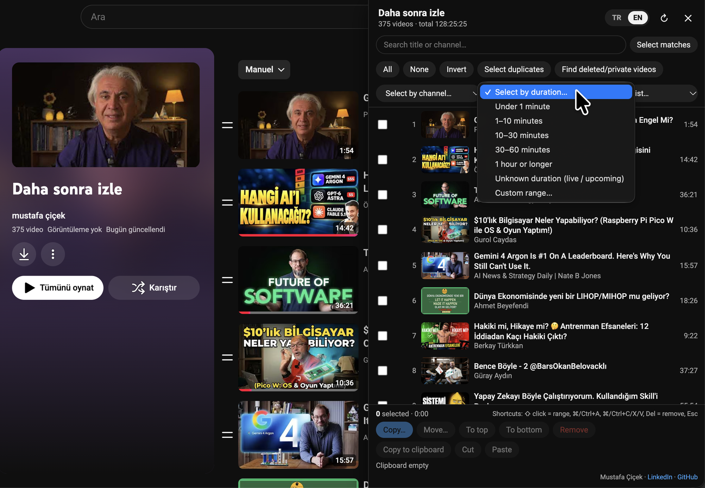

# Playlist Multiselect for YouTube

**English** · [Türkçe](#türkçe)

A Chrome extension (Manifest V3) that lets you select multiple videos in a YouTube playlist and act on them in bulk: copy, move, remove, sort, and find duplicates or deleted/private videos. The interface is available in English and Turkish and follows YouTube's language.

**Author:** Mustafa Çiçek · [LinkedIn](https://www.linkedin.com/in/mustafacicek-eee/) · [GitHub](https://github.com/mustafacicek-eee)

## Screenshots
| | |
|---|---|
|  |  |
| **The ☑ button** opens the panel on any playlist page | **The panel**, with the TR / EN language toggle |
|  |  |
| **Sort playlist** by title, channel, duration, reverse or shuffle | **Select by duration**, including a custom range |

## Installation
1. Download the latest **`youtube-playlist-multiselect-vX.Y.Z.zip`** from the [Releases page](https://github.com/mustafacicek-eee/youtube-playlist-multiselect/releases/latest) and unzip it (double-click on macOS; right-click → *Extract All* on Windows).
2. In Chrome, open `chrome://extensions` and turn on **Developer mode** (top right).
3. Click **Load unpacked** and choose the unzipped folder (the one that contains `manifest.json`).
4. Open a YouTube playlist (`/playlist?list=…`). A **☑ Multiselect** button appears in the bottom left.

**Updating:** download the new zip from Releases, replace the old folder with the new one, then click **↻** on the extension's card in `chrome://extensions`.

Developers can also clone the repository and load it the same way: `git clone https://github.com/mustafacicek-eee/youtube-playlist-multiselect.git`

## Features
- Click to select, **Shift+click** for a range, `⌘/Ctrl+A` for all; navigate with ↑/↓ and Space
- Search titles/channels and **Select matches**; **Invert**; **Select duplicates** (all but the first)
- **Select by channel:** a dropdown lists channels by video count (most first); right-click → "Select all from this channel"
- **Select by duration:** under 1 min, 1–10 min, 10–30 min, 30–60 min, 1 hour and over, unknown duration (live/upcoming), or a **custom range** in minutes (comma or dot for decimals; empty upper bound = no limit). Ranges include the lower bound and exclude the upper bound; presets do not overlap.
- Channel and duration selections **add to** the current selection and apply only to visible (search-matching) videos.
- **Find deleted/private videos:** scans videos YouTube hides. A video is removable only if it passes both checks: it has no title in the playlist **and** YouTube's oEmbed service returns 404 (deleted) or 403 (private). 401 is deliberately treated as "unverified", because healthy videos with embedding disabled can also return 401. Videos that are still public but blocked in your region, and anything unverified, are never removed. After removal the playlist is re-scanned and the result is reported.
- **Copy… / Move…** to one of your playlists, to any playlist by URL/ID, or to a new (private/unlisted/public) playlist. Videos already in the target are skipped.
- **To top / To bottom:** moves the selection while keeping its order (with the fewest possible moves)
- **Sort playlist:** by title, channel, duration, reverse, shuffle. The result is re-read from the server and verified afterwards.
- **Remove** (with confirmation) and **Re-add** (re-added videos go to the end)
- Clipboard: `⌘/Ctrl+C` copy, `⌘/Ctrl+X` cut, switch playlists, `⌘/Ctrl+V` paste (works across tabs)
- Context menu, light/dark theme, English/Turkish interface: switch with the **TR | EN** toggle in the panel header (your choice is remembered; by default it follows YouTube's language)

## Privacy and security
Full privacy policy: [PRIVACY.md](PRIVACY.md)

- The `permissions` field is empty: the extension requests no Chrome permissions and runs only on `https://www.youtube.com/*`.
- All requests go to the `youtube.com/youtubei/v1/...` endpoints that YouTube's own web client uses, with your existing session. No data is sent to third parties and there is no analytics.
- Clipboard data and your language choice are stored only in the browser's `youtube.com` localStorage (`msx.clipboard.v1`, `msx.lang.v1`).

## Verification status (2026-09-24)
**Tested live on a signed-in account, using temporary private test playlists:**
- Reading playlists (signed in), fetching your playlists (`get_add_to_playlist`), SAPISIDHASH authorization
- Creating playlists, adding, removing, re-adding, copying (skipping duplicates), moving
- Sorting: move before/after, batches of 20; a 236-video title sort from the UI (210 moves, ~15 s) was verified on the server
- UI: panel, Shift range selection, channel/duration selection (counts matched exactly), move to bottom, Delete to remove + Re-add, Copy… dialog, ⌘C/⌘V between playlists, detecting YouTube's in-app navigation, Trusted Types (0 violations)
- Hidden video detection in both formats: someone else's playlist (982 videos: 8 deleted, 2 private, 35 region-restricted) and your own playlist (a region-restricted video was correctly kept)

**Not verified:**
- Removing a **truly deleted** row from your own playlist: YouTube does not allow adding deleted videos to a playlist (it silently skips them, both one by one and in playlist imports), so a test row could not be created. The removal method (`ACTION_REMOVE_VIDEO` with the row's own `setVideoId`) was verified live separately, and the post-removal re-scan reports the result honestly.
- YouTube shortcuts (e.g. `k`, Space) not firing while the panel is open: keys pressed in the panel were measured not to reach the page's normal listeners, but a side-by-side test was not possible because YouTube shortcuts did not work at all in the test browser.
- YouTube may change its internal APIs without notice; the extension then shows an error message. Moving and sorting never delete videos.

## Limitations
- Unavailable videos that YouTube hides do not appear in the main list; use **Find deleted/private videos** to scan them.
- Auto-generated mixes (`RD…`) cannot be edited, only copied.
- After a change, YouTube's own page may still show the old state; use **Refresh page** in the panel.

## License
[MIT](LICENSE) © 2026 Mustafa Çiçek. You may use, change and share this code; the copyright notice must be kept.

This project is not affiliated with or endorsed by YouTube or Google.

**Disclaimer:** This extension uses YouTube's internal web API (the same endpoints youtube.com itself uses). Use it at your own risk; complying with the [YouTube Terms of Service](https://www.youtube.com/static?template=terms) is the user's responsibility.

---

## Türkçe

YouTube oynatma listelerinde birden fazla videoyu seçip toplu işlem yapmanı sağlayan Chrome eklentisi (Manifest V3): kopyala, taşı, kaldır, sırala, tekrarları ve silinmiş/özel videoları bul. Arayüz Türkçe ve İngilizcedir; YouTube'un diline göre seçilir.

**Geliştirici:** Mustafa Çiçek · [LinkedIn](https://www.linkedin.com/in/mustafacicek-eee/) · [GitHub](https://github.com/mustafacicek-eee)

### Ekran görüntüleri
Ekran görüntüleri yukarıdaki [Screenshots](#screenshots) bölümünde: oynatma listesi sayfasındaki **☑ Çoklu seçim** düğmesi, TR / EN dil düğmeli panel, **Listeyi sırala** ve **Süreye göre seç** menüleri.

### Kurulum
1. [Releases sayfasından](https://github.com/mustafacicek-eee/youtube-playlist-multiselect/releases/latest) en güncel **`youtube-playlist-multiselect-vX.Y.Z.zip`** dosyasını indir ve aç (macOS'ta çift tıkla; Windows'ta sağ tık → *Tümünü Ayıkla*).
2. Chrome'da `chrome://extensions` adresine git, sağ üstten **Geliştirici modu**nu aç.
3. **Paketlenmemiş öğe yükle** → açtığın klasörü seç (içinde `manifest.json` olan klasör).
4. YouTube'da bir oynatma listesi aç (`/playlist?list=…`). Sol altta **☑ Çoklu seçim** düğmesi çıkar.

**Güncelleme:** Releases sayfasından yeni zip'i indir, eski klasörü yenisiyle değiştir, sonra `chrome://extensions` sayfasında eklentinin kartındaki **↻** simgesine bas.

Geliştiriciler repoyu klonlayıp aynı şekilde yükleyebilir: `git clone https://github.com/mustafacicek-eee/youtube-playlist-multiselect.git`

### Özellikler
- Tık ile seç, **Shift+tık** ile aralık seç, `⌘/Ctrl+A` ile tümünü seç, ↑/↓ ve boşluk ile klavyeden gezin
- Başlık/kanal araması ve **Eşleşenleri seç**; **Ters çevir**; **Tekrarları seç** (ilki hariç)
- **Kanala göre seç:** açılır listede kanallar video sayısıyla (çoktan aza); sağ tıkta "Bu kanaldan tümünü seç"
- **Süreye göre seç:** 1 dk'dan kısa, 1–10 dk, 10–30 dk, 30–60 dk, 1 saat ve üzeri, süresi belirsiz (canlı/yaklaşan) ya da **özel aralık** (dakika; ondalık için virgül/nokta; üst sınır boşsa sınırsız). Aralıklar alt sınırı dahil, üst sınırı hariç tutar; hazır aralıklar çakışmaz.
- Kanal/süre seçimleri mevcut seçime **ekler** ve yalnızca görünen (aramaya uyan) videolara uygulanır.
- **Silinmiş/özel videoları bul:** YouTube'un gizlediği videoları tarar. Bir video yalnızca iki kontrolden de geçerse kaldırılabilir: listede başlığı yoktur **ve** YouTube oEmbed servisi 404 (silinmiş) ya da 403 (özel) döndürür (401 bilerek 'doğrulanamadı' sayılır: gömmesi kapalı sağlam videolar da 401 dönebilir). Hâlâ yayında olup bölgende izlenemeyen videolar ve doğrulanamayanlar hiçbir zaman kaldırılmaz. Kaldırmadan sonra liste yeniden taranır ve sonuç raporlanır.
- **Kopyala…** / **Taşı…**: kendi listelerinden birine, URL/ID ile herhangi bir listeye ya da yeni (özel/liste dışı/herkese açık) listeye. Hedefte zaten olan videolar atlanır.
- **Başa al / Sona al**: seçilenleri kendi sıralarını koruyarak taşır (en az sayıda taşıma ile)
- **Listeyi sırala**: başlık, kanal, süre, ters çevir, karıştır. İşlemden sonra sonuç sunucudan yeniden okunup doğrulanır.
- **Kaldır** (onaylı) ve **Geri ekle** (geri eklenenler liste sonuna gider)
- Pano: `⌘/Ctrl+C` kopyala, `⌘/Ctrl+X` kes, başka listeye geç, `⌘/Ctrl+V` yapıştır (sekmeler arasında da çalışır)
- Sağ tık menüsü, açık/koyu tema, Türkçe/İngilizce arayüz: panel başlığındaki **TR | EN** düğmesiyle değiştirilir (seçim hatırlanır; seçim yapılmamışsa YouTube'un dili kullanılır)

### Gizlilik ve güvenlik
Gizlilik politikasının tamamı: [PRIVACY.md](PRIVACY.md)

- `permissions` alanı boş: eklenti hiçbir Chrome izni istemez, yalnızca `https://www.youtube.com/*` sayfalarında çalışır.
- Tüm istekler YouTube'un kendi web istemcisinin kullandığı `youtube.com/youtubei/v1/...` uç noktalarına, senin oturumunla gider. Üçüncü tarafa veri gönderilmez, analitik yoktur.
- Pano verisi ve dil seçimin yalnızca tarayıcının `youtube.com` localStorage'ında (`msx.clipboard.v1`, `msx.lang.v1`) tutulur.

### Doğrulama durumu (2026-09-24)
**Oturum açık gerçek hesapta, geçici özel test listelerinde canlı doğrulandı:**
- Liste okuma (oturumlu), listelerini getirme (`get_add_to_playlist`), SAPISIDHASH yetkilendirmesi
- Liste oluşturma, ekleme, kaldırma, geri ekleme, kopyalama (tekrar atlama), taşıma
- Sıralama: önüne/arkasına taşıma, 20'lik toplu gönderim; arayüzden 236 videoluk başlık sıralaması (210 taşıma, ~15 sn) sunucuda doğrulandı
- Arayüz: panel, shift aralık seçimi, kanal/süre seçimi (beklenen sayılarla birebir), sona alma, Delete ile kaldırma + Geri ekle, Kopyala… penceresi, ⌘C/⌘V ile listeler arası yapıştırma, YouTube içi sayfa geçişini algılama, Trusted Types (0 ihlal)
- Gizli video tespiti iki biçimde de: başkasının listesi (982 videoda 8 silinmiş, 2 özel, 35 bölge kısıtlı) ve kendi listen (bölge kısıtlı video doğru korundu)

**Doğrulanamayanlar:**
- Kendi listende **gerçekten silinmiş** bir satırın kaldırılması: YouTube silinmiş videoların listeye eklenmesine izin vermiyor (hem tek tek hem liste aktarmada sessizce atlıyor), bu yüzden test satırı oluşturulamadı. Kaldırma yöntemi (satırın kendi `setVideoId`'si ile `ACTION_REMOVE_VIDEO`) ayrıca canlı doğrulandı; işlem sonrası yeniden tarama sonucu dürüstçe raporlar.
- Panel açıkken YouTube kısayollarının (ör. `k`, boşluk) tetiklenmemesi: panelde basılan tuşlar sayfanın normal dinleyicilerine ulaşmıyor (ölçüldü), ancak test tarayıcısında YouTube kısayolları hiç çalışmadığı için karşılaştırmalı test yapılamadı.
- YouTube iç API'lerini habersiz değiştirebilir; o durumda eklenti hata mesajı gösterir. Taşıma ve sıralama video silmez.

### Sınırlamalar
- YouTube'un gizlediği erişilemeyen videolar ana listede görünmez; **Silinmiş/özel videoları bul** ile ayrıca taranır.
- Otomatik karışık listeler (`RD…`) düzenlenemez, yalnızca kopyalanabilir.
- Değişiklikten sonra YouTube'un kendi sayfası eski hâli gösterebilir; paneldeki **Sayfayı yenile** ile güncelle.

### Lisans
[MIT](LICENSE) © 2026 Mustafa Çiçek. Kodu kullanabilir, değiştirebilir ve paylaşabilirsin; telif satırının korunması gerekir.

Bu proje YouTube veya Google ile bağlantılı değildir ve onlar tarafından onaylanmamıştır.

**Sorumluluk reddi:** Bu eklenti YouTube'un iç web API'sini (youtube.com'un kendisinin kullandığı uç noktaları) kullanır. Kullanım riski kullanıcıya aittir; [YouTube Kullanım Şartları](https://www.youtube.com/static?template=terms)'na uymak kullanıcının sorumluluğundadır.
